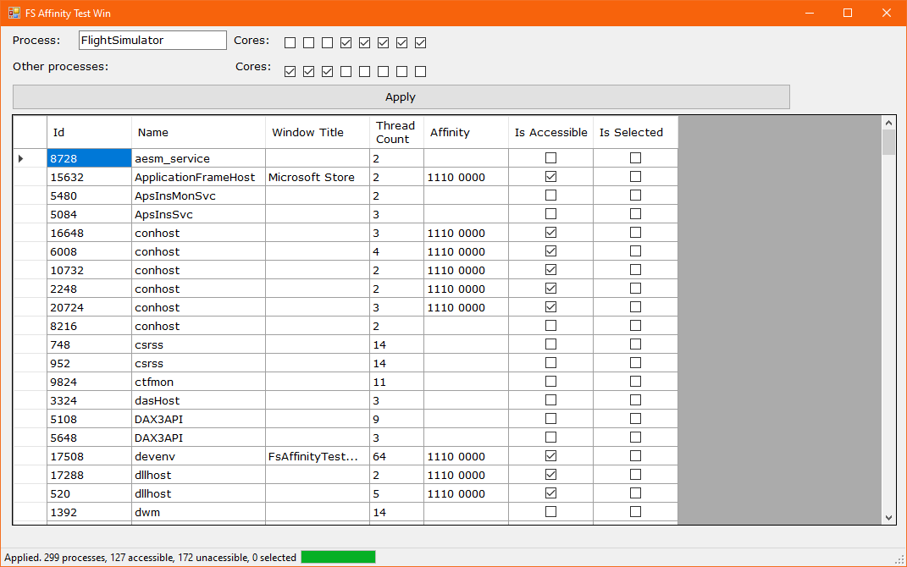

# Simple (FS) Win Affinity Test

## Explanations
This app sets the affinity for all the accessable processes in the Win OS. The specific process can have set the different affinity than the other ones. It is useful to preserve the custom cores for the specific process(es) and the other cores for the rest.

## Motivation
This app was created to check if a reservation of specific cores for FS2020 can increase its performance. Short answer: no.

## Usage
Run the application. It is suggested to run the app in the administrator mode, otherwise many running processes will not be accessible for the app.
Then:
1. Set the name of the selected process(es). If you know, you can use the regular expression in the text field. The name is case-sensitive.
2. Check the corresponding check-boxes for each your core. The first row is for the selected processes, the second row is for the other processes.
3. Press the 'Apply' button and wait for the finish (may take a while).
4. Check the result in the grid.

The affinity of the processes is set until the OS restart or until the another update.
